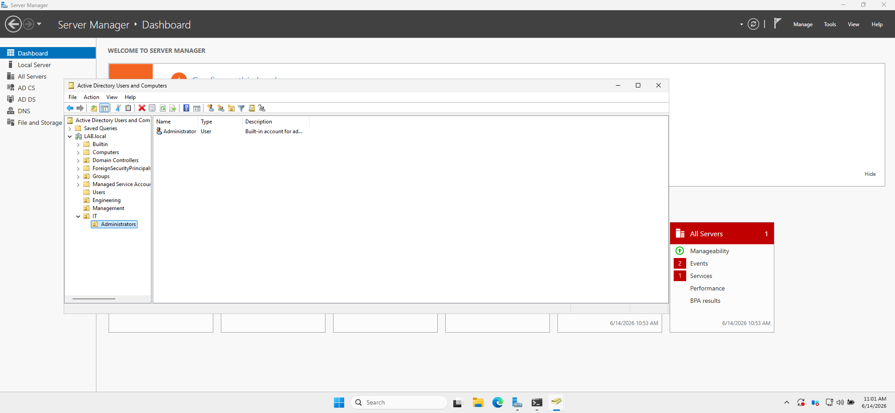
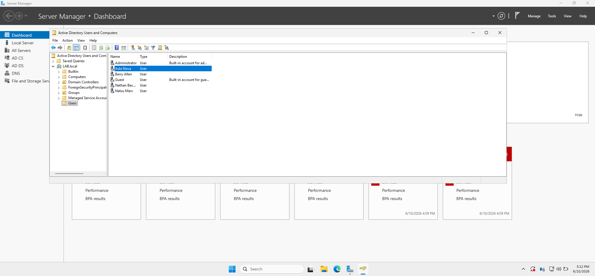
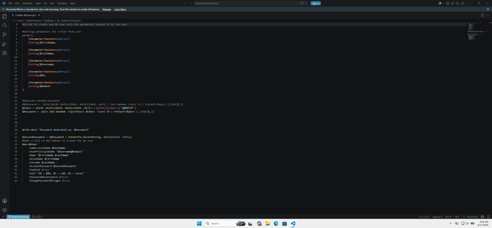
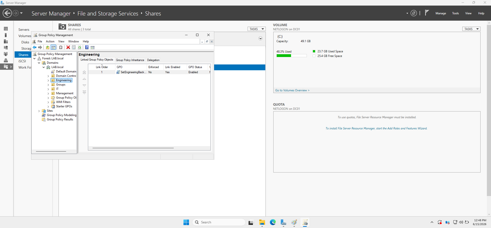
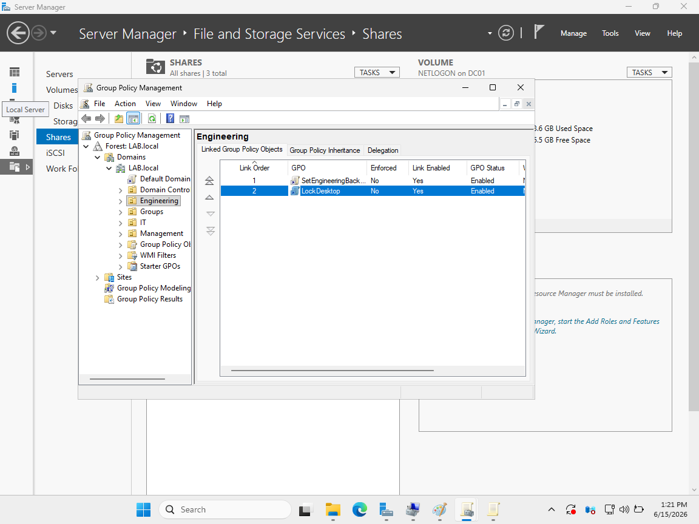
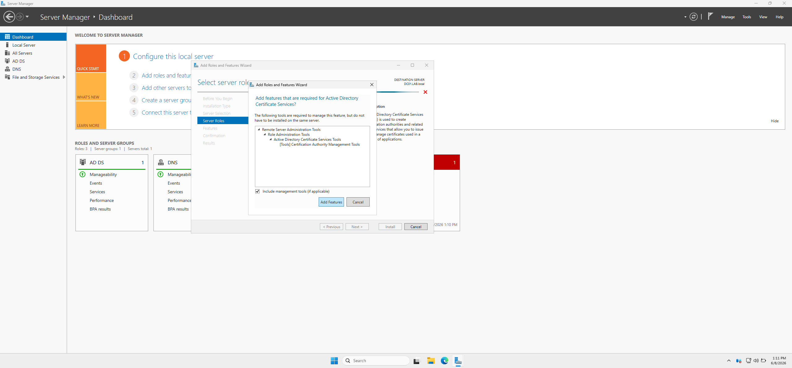
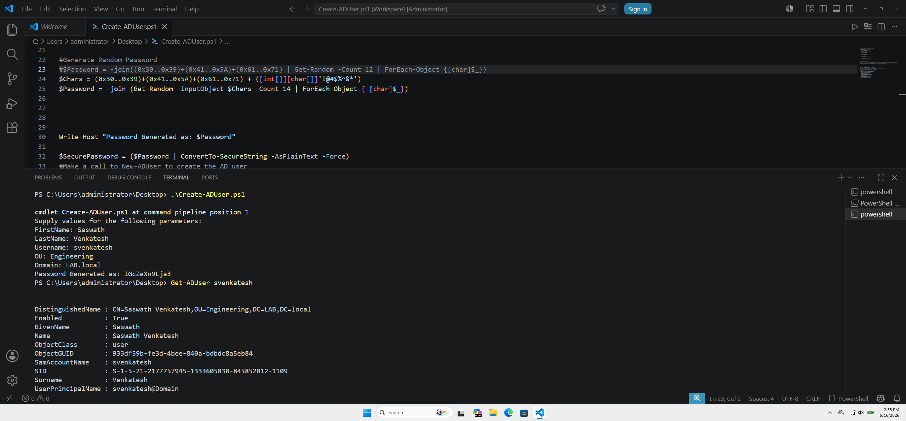

# 🖥️ Active Directory Home Lab


A hands-on home lab simulating an enterprise Windows Server environment using Active Directory Domain Services, Group Policy, and PowerShell automation on a `LAB.local` domain.

---

## 📐 Architecture & OU Structure



**Domain:** `LAB.local`  
**OUs:** Engineering · IT · Management · Administrators  
**Workstation:** WS01 joined to domain

---

## 🛠️ Technologies Used

| Technology | Role |
|---|---|
| Windows Server + AD DS | Domain controller, LAB.local domain |
| Group Policy (GPO) | Engineering background + desktop lock policy |
| PowerShell | Automated user provisioning |
| AD Certificate Services | PKI infrastructure |
| VirtualBox | WS01 workstation VM |
| ADUC | User & computer management |

---

## ⚙️ What Was Built

### Active Directory Deployment

Installed AD DS, promoted a Windows Server VM to Domain Controller, and created the LAB.local domain with four OUs: Engineering, IT, Management, and Administrators.

### User & Computer Management





Created and managed domain users, joined workstation WS01 to the domain, and verified membership via ADUC.

### Group Policy





Created and linked GPOs to the Engineering OU including `SetEngineeringBackground` and `LockDesktop`. Verified policy deployment on WS01 — the Engineering Dept. wallpaper was successfully applied via Group Policy.

### AD Certificate Services



Installed and configured AD CS on the domain controller to provide PKI infrastructure for the lab.

---

## 💻 PowerShell Automation

Created `Create-ADUser.ps1` to automate user provisioning. The script accepts five mandatory parameters, generates a secure 14-character password with a mixed character set including special characters, converts it to a SecureString, and calls `New-ADUser` to place the user in the correct OU.

```powershell
#Script to create new AD user with the parameters passed in by the user

param (
    [Parameter(Mandatory=$true)]
    [string]$FirstName,

    [Parameter(Mandatory=$true)]
    [string]$LastName,

    [Parameter(Mandatory=$true)]
    [string]$Username,

    [Parameter(Mandatory=$true)]
    [string]$OU,

    [Parameter(Mandatory=$true)]
    [string]$Domain
)

#Generate Random Password
$Chars = (0x30..0x39)+(0x41..0x5A)+(0x61..0x71) + ([int[]][char[]]'!@$%^&*')
$Password = -join (Get-Random -InputObject $Chars -Count 14 | ForEach-Object { [char]$_ })

Write-Host "Password Generated as: $Password"

$SecurePassword = ($Password | ConvertTo-SecureString -AsPlainText -Force)
#Make a call to New-ADUser to create the AD user
New-ADUser `
    -SamAccountName $Username `
    -UserPrincipalName "$Username@$Domain" `
    -Name "$FirstName $LastName" `
    -GivenName $FirstName `
    -Surname $LastName `
    -AccountPassword $SecurePassword `
    -Enabled $true `
    -Path "OU = $OU, DC = LAB, DC = local" `
    -PasswordNeverExpire $false `
    -ChangePasswordAtLogon $true
```



---

## 🐛 Troubleshooting

**PowerShell execution policy**
```powershell
Set-ExecutionPolicy -Scope Process Bypass
```
Scripts were disabled by default — set execution policy to Bypass for the current process to allow running.

**Password complexity rejected by AD**  
Initial password generator only used alphanumeric characters. Added special characters (`!@$%^&*`) to the character pool to meet domain password complexity requirements.

**Script file extension issue**  
Script was saved as `Create-ADUser.ps1.code-workspace` — corrected to `Create-ADUser.ps1`.

---

## 📚 Lessons Learned

- **SIDs** — Windows uses Security Identifiers, not usernames, for permissions and identification
- **ASCII hex ranges in PowerShell** — `0x30..0x39` = 0–9, `0x41..0x5A` = A–Z, `0x61..0x7A` = a–z
- **SecureString handling** — AD requires passwords as SecureString via `ConvertTo-SecureString`
- **Domain password policy** — complexity rules enforced at the domain level, not just the script

---

## 🔮 Future Improvements

- Additional Group Policy controls
- Active Directory permissions and delegation
- Shared folders and NTFS permissions
- DNS and DHCP configuration
- Expanded PowerShell automation
- User lifecycle management workflows

---

*I'm excited to continue building on this lab, deepen my understanding of Windows Server administration and Active Directory, and gain more hands-on experience with automation and enterprise system management.*
